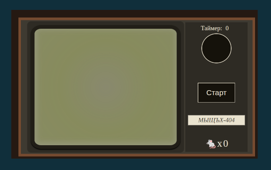

# Cat and Mouse

This simple program demonstrates my experience with HTML, CSS, and JavaScript. In the program, a hero cat automatically moves around the screen and catches mice while the timer is running. In 60 seconds, it can catch a maximum of 3 mice (by default). The program was created for fun and developed by me over the weekend. Please do not consider this a serious demonstration; it's just a small demo version written for enjoyment.

Стартуй!

[DRMO RUN](https://blackbirdcoder.github.io/cat-and-mouse/src/index.html "demo")
